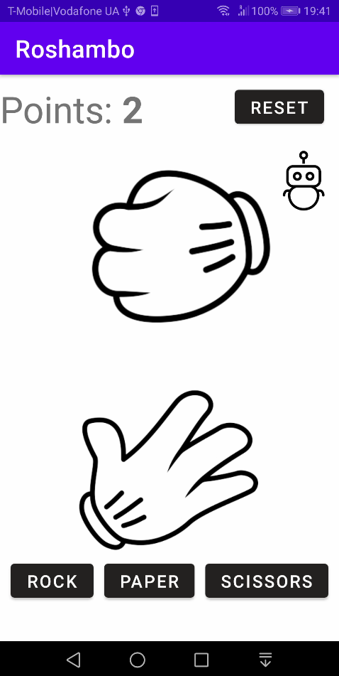
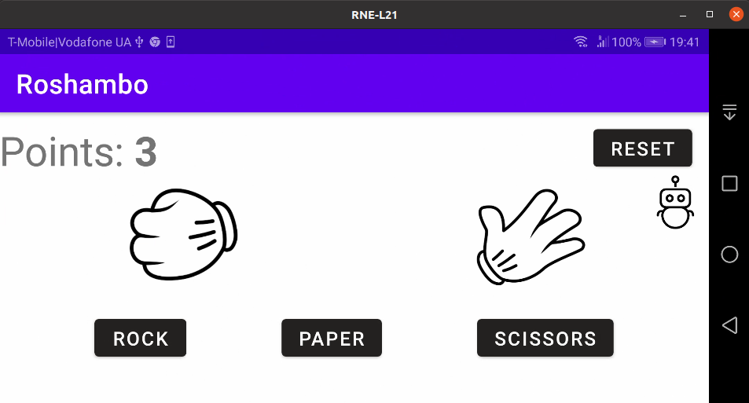
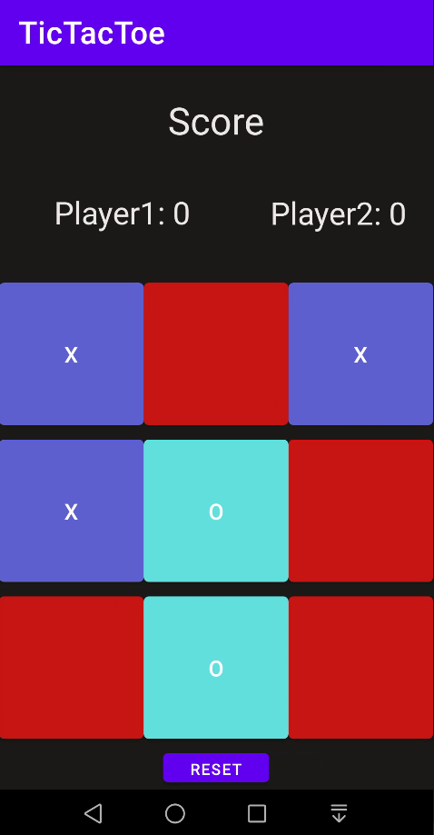
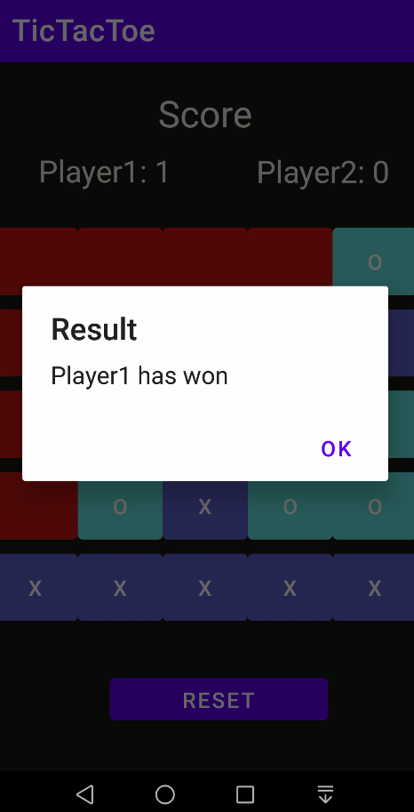

# mobile-applications
# Table Of Contents
- [Roshambo](#roshambo)
	- [Layout](#layout)
		- [Portrait](#portrait)
		- [Landscape](#landscape)
	- [Code Example](#code-example)
- [TicTacToe](#tictactoe)
	- [Layout](#layout)
		- [Main](#main)
		- [Board](#board3x3)
		- [Round Win](#round-win)
    - [Code Example](#code-example)


		
---------------------------
# [Roshambo](https://github.com/sqoshi/mobile-applications/list01/exercise2)

[Rock paper scissors](https://en.wikipedia.org/wiki/Rock_paper_scissors).
Simple game implementation in Kotlin.

### Layout
#### Portrait


#### Landscape

### Code Example
```kotlin
    override fun onCreate(savedInstanceState: Bundle?) {
        super.onCreate(savedInstanceState)
        binding = ActivityMainBinding.inflate(layoutInflater)
        val view = binding.root
        setContentView(view)
        if (savedInstanceState != null) {
            val value = savedInstanceState.getInt("counter")
            binding.counter.text = value.toString()
            counter = value
        }
    }
```
---------------------------

# [TicTacToe](https://github.com/sqoshi/mobile-applications/list02/exercise1)

[TicTacToe](https://en.wikipedia.org/wiki/Tic-tac-toe) game implementation.

Games offers 2 boards in size 3x3 and 5x5.

Players can play kotlin.maxint rounds and still recognize who is winning.

### Layout
#### Main


#### Board3x3


#### Round Win
Example win in 5x5 board mode.



### Code Example
```kotlin
    private fun onButtonClick(button: Button, r: Int, c: Int) {
        if (!isFieldBusy(button)) {
            if (player1Turn) {
                button.text = player1Symbol
                button.setBackgroundColor(Color.parseColor("#5e60ce"))
                player1Turn = false
                player1Fields.add(intArrayOf(r, c))
                if (hasWin(player1Fields)) {
                    basicAlert(findViewById(R.id.resetButton), "Player1 has won")
                    player1Score += 1
                    updateScore(player1ScoreTextView, player1Score)

                }

            } else {
                button.text = player2Symbol
                button.setBackgroundColor(Color.parseColor("#64dfdf"))
                player1Turn = true
                player2Fields.add(intArrayOf(r, c))
                if (hasWin(player2Fields)) {
                    basicAlert(findViewById(R.id.resetButton), "Player2 has won")
                    player2Score += 1
                    updateScore(player2ScoreTextView, player2Score)
                }

            }

            if ((player1Fields.size + player2Fields.size).toDouble() == size.toDouble().pow(2.0)) {
                basicAlert(findViewById(R.id.resetButton), "Draw")
                roundCounter++
            }
        } else {
            Toast.makeText(applicationContext, "Field is busy.", Toast.LENGTH_SHORT).show()

        }
    }
```

----------------------------

# [HangMan](https://github.com/sqoshi/mobile-applications/list02/exercise2)


----------------------------
