# Table Of Contents
- [Table Of Contents](#table-of-contents)
- [Roshambo](#roshambo)
    - [Layout](#layout)
      - [Portrait](#portrait)
      - [Landscape](#landscape)
    - [Code Example](#code-example)
- [TicTacToe](#tictactoe)
    - [Layout](#layout-1)
      - [Main](#main)
      - [Board3x3](#board3x3)
      - [Round Win](#round-win)
    - [Code Example](#code-example-1)
- [HangMan](#hangman)
    - [Layout](#layout-2)
      - [Portrait](#portrait-1)
      - [Landscape](#landscape-1)
      - [Lost Popup](#lost-popup)
    - [Code Example](#code-example-2)
- [ToDo](#todo)
    - [Introduction](#introduction)
    - [General Info](#general-info)
      - [Sorts](#sorts)
      - [Filter by priority](#filter-by-priority)
      - [Task structure](#task-structure)
      - [Icon chooser](#icon-chooser)
      - [Calendar](#calendar)
    - [Layout](#layout-3)
      - [Portrait](#portrait-2)
        - [Tasks list](#tasks-list)
        - [Task update](#task-update)
        - [Task deletion](#task-deletion)
        - [All tasks deletion](#all-tasks-deletion)
      - [Landscape](#landscape-2)
        - [Tasks list](#tasks-list-1)
        - [Task addition](#task-addition)
    - [Code Example](#code-example-3)
  - [Snapgram](#snapgram)
    - [Introduction](#introduction-1)
    - [General Info](#general-info-1)
    - [Layout](#layout-4)
      - [Gallery](#gallery)
      - [Camera](#camera)
      - [Image](#image)
    - [CodeExample](#codeexample)
  - [Arcanoid](#arcanoid)


---------------------------
# [Roshambo](https://github.com/sqoshi/mobile-applications/tree/master/list01/exercise2)

[Rock paper scissors](https://en.wikipedia.org/wiki/Rock_paper_scissors).
Simple game implementation in Kotlin.

### Layout
#### Portrait


#### Landscape

### Code Example
```kotlin
    override fun onCreate(savedInstanceState: Bundle?) {
        super.onCreate(savedInstanceState)
        binding = ActivityMainBinding.inflate(layoutInflater)
        val view = binding.root
        setContentView(view)
        if (savedInstanceState != null) {
            val value = savedInstanceState.getInt("counter")
            binding.counter.text = value.toString()
            counter = value
        }
    }
```
---------------------------

# [TicTacToe](https://github.com/sqoshi/mobile-applications/tree/master/list02/TicTacToe)

[TicTacToe](https://en.wikipedia.org/wiki/Tic-tac-toe) game implementation in Kotlin.

Games offers 2 boards in size 3x3 and 5x5.

Players can play kotlin.maxint rounds and still recognize who is winning.

### Layout
#### Main
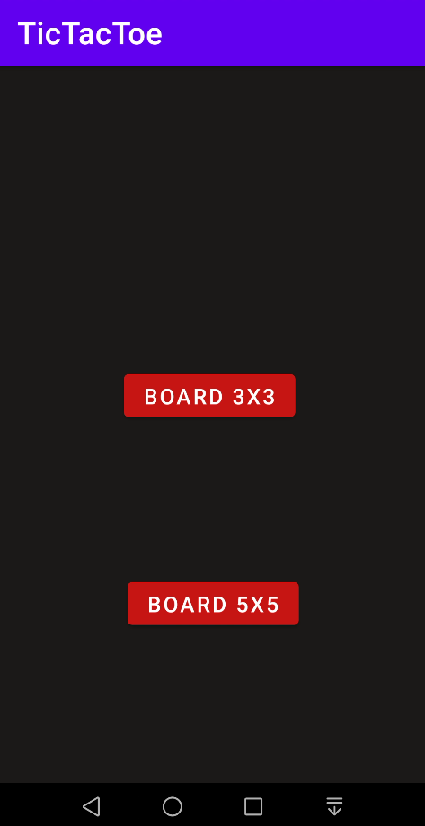

#### Board3x3
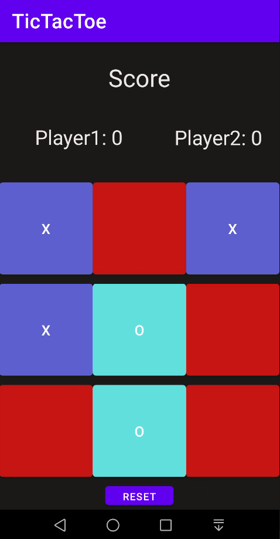

#### Round Win
Example win in 5x5 board mode.

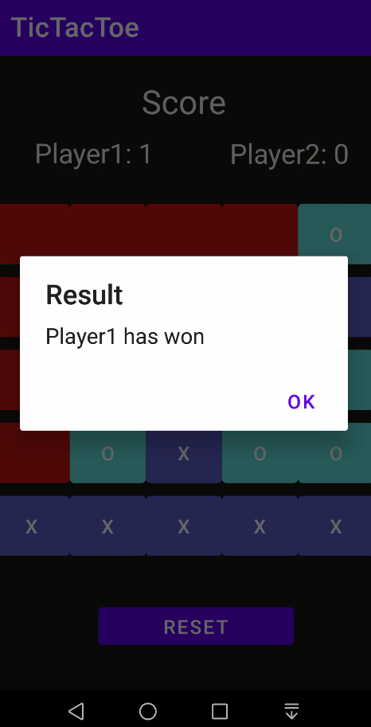

### Code Example
```kotlin
    private fun onButtonClick(button: Button, r: Int, c: Int) {
        if (!isFieldBusy(button)) {
            if (player1Turn) {
                button.text = player1Symbol
                button.setBackgroundColor(Color.parseColor("#5e60ce"))
                player1Turn = false
                player1Fields.add(intArrayOf(r, c))
                if (hasWin(player1Fields)) {
                    basicAlert(findViewById(R.id.resetButton), "Player1 has won")
                    player1Score += 1
                    updateScore(player1ScoreTextView, player1Score)

                }

            } else {
                button.text = player2Symbol
                button.setBackgroundColor(Color.parseColor("#64dfdf"))
                player1Turn = true
                player2Fields.add(intArrayOf(r, c))
                if (hasWin(player2Fields)) {
                    basicAlert(findViewById(R.id.resetButton), "Player2 has won")
                    player2Score += 1
                    updateScore(player2ScoreTextView, player2Score)
                }

            }

            if ((player1Fields.size + player2Fields.size).toDouble() == size.toDouble().pow(2.0)) {
                basicAlert(findViewById(R.id.resetButton), "Draw")
                roundCounter++
            }
        } else {
            Toast.makeText(applicationContext, "Field is busy.", Toast.LENGTH_SHORT).show()

        }
    }
```

----------------------------
# [HangMan](https://github.com/sqoshi/mobile-applications/tree/master/list02/TicTacToe)
[Hangman](https://en.wikipedia.org/wiki/Hangman_(game)) game implementation in Kotlin.

### Layout
#### Portrait
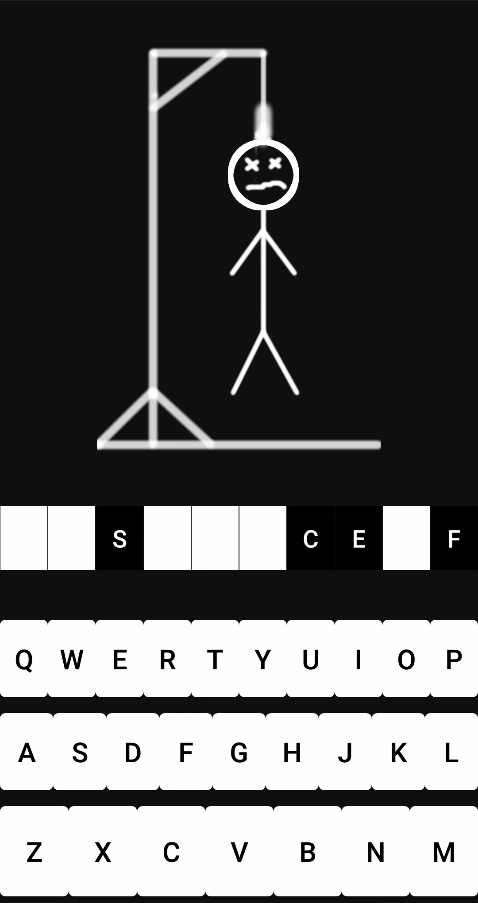

#### Landscape
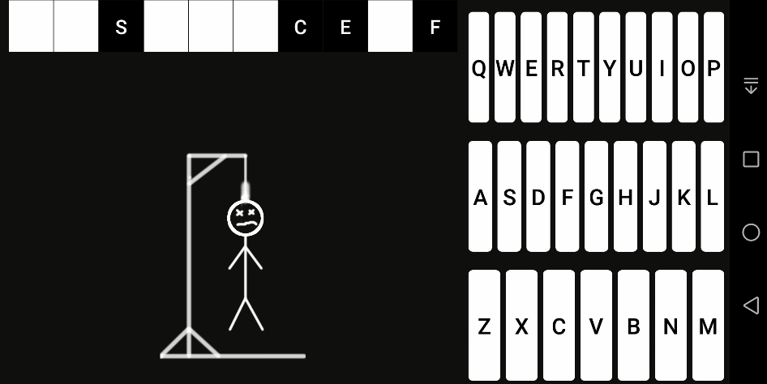

#### Lost Popup

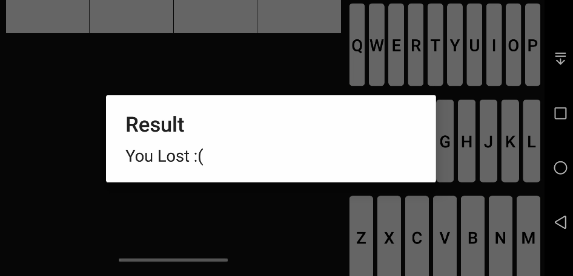

### Code Example
```kotlin
    private fun onOrientationChange(savedInstanceState: Bundle) {
        imageIndex = savedInstanceState.getInt("imageIndex")
        displayNextHangmanImage(imageIndex)
        currentWord = savedInstanceState.getString("currentWord").toString()
        val alreadyDiscoveredLettersAsStr = savedInstanceState.getString("alreadyDiscoveredLetters")
        if (alreadyDiscoveredLettersAsStr != null) {
            alreadyDiscoveredLetters = alreadyDiscoveredLettersAsStr.split(" ").toHashSet()
        }
        showBlurredWord(currentWord)
        for (x in alreadyDiscoveredLetters) {
            showLetter(x)
        }

    }
```
----------------------------
# [ToDo](https://github.com/sqoshi/mobile-applications/tree/master/list03/ToDo)

### Introduction
ToDo application in kotlin. This app may be usefull for android users who sometimes forgot about their schedule. 

### General Info
Application allow to add tasks to table in `Room` abstract database (database is instantinated using `singleton pattern`) which is displayed on main fragment of program. During task inserting procedure program adds `alarm` by alarm manager to our phone, so when task is close to expiration date phone vibrates, ringing and user face clickable popup that leads to `ToDo` app activity or creates new one.


User can perform operations as `read`,`add`,`delete`,`update`, `delete-all`, `filter` and `sort` by every field in task table so we can say that app handles CRUD requests.

Few of them can be found inside menu bar.
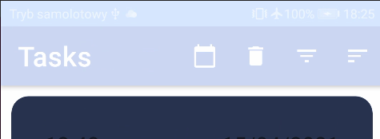


Application save instances values in outState and remembers thats how configuration of state after rotation.

User can set priority and type of the task.

#### Sorts

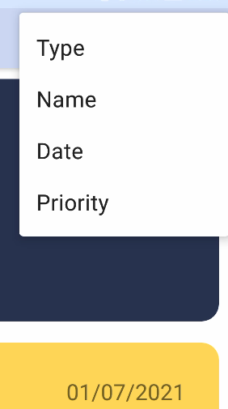


#### Filter by priority
Priority is an `Enum(HIGH,MEDIUM,LOW)` each value correspond to the appropriate color of task.

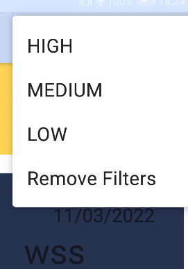

#### Task structure
Task structure: 
```kotlin
data class Task(
    @PrimaryKey(autoGenerate = true)
    val id: Int,
    val name: String,
    val date: Date,
    val description: String,
    val type: String,
    val priority: String,
) : Parcelable
```


#### Icon chooser
Type is responsible for an icon app allows for types as on the screen below:
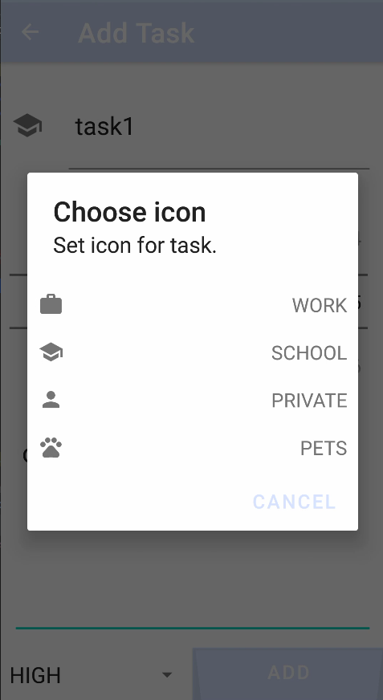

#### Calendar
All tasks can also be viewed via Calendar. Date click lists all tasks assigned to this day as LiveData.
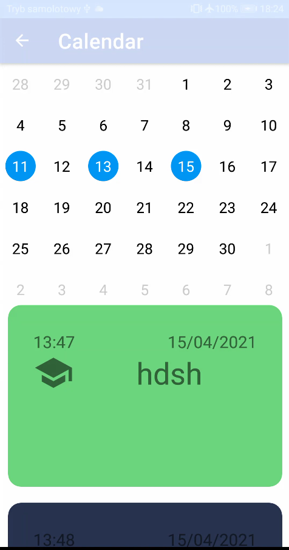
### Layout
Application handles both landscape and portrait layouts.

#### Portrait
##### Tasks list
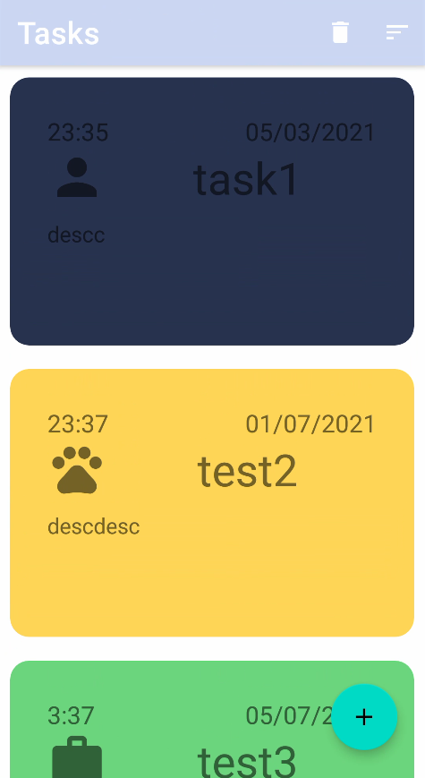
##### Task update
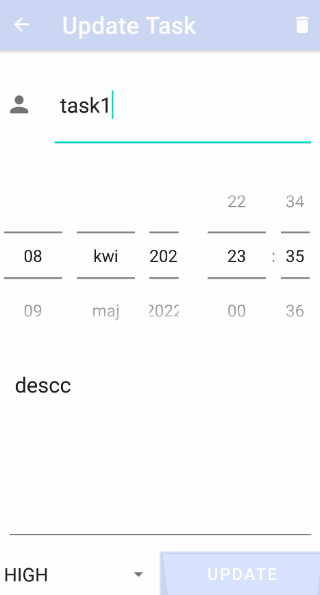
##### Task deletion
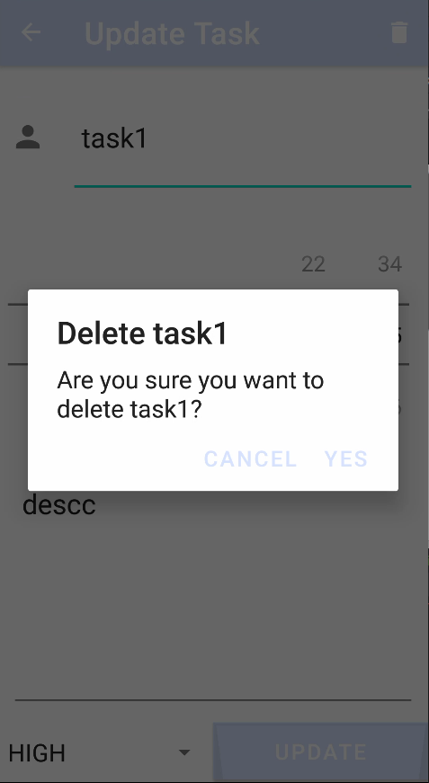
##### All tasks deletion
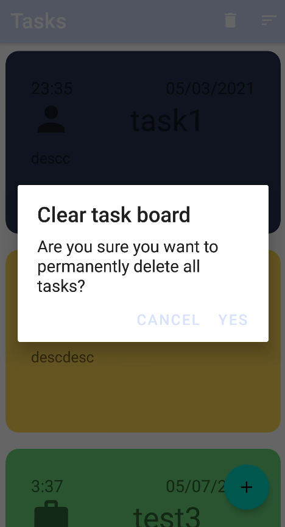
#### Landscape
##### Tasks list
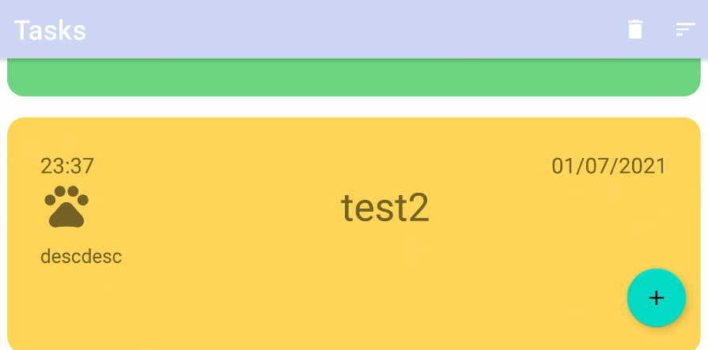
##### Task addition
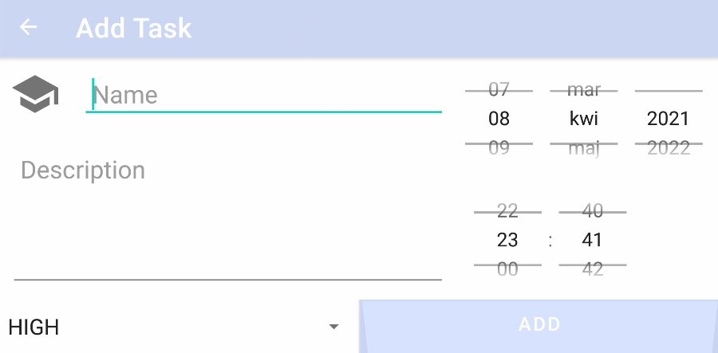

### Code Example

``` kotlin
private fun setUpNotification(hour: Int, minute: Int, day: Int, month: Int, year: Int) {
        val calendar: Calendar = Calendar.getInstance()
        calendar.set(Calendar.HOUR_OF_DAY, hour)
        calendar.set(Calendar.MINUTE, minute)
        calendar.set(Calendar.SECOND, 0)
        calendar.set(Calendar.YEAR, year)
        calendar.set(Calendar.MONTH, month)
        calendar.set(Calendar.DAY_OF_MONTH, day)
        if (calendar.time < Date()) calendar.add(Calendar.DAY_OF_MONTH, 1)
        val intent = Intent(activity?.applicationContext, NotificationReceiver::class.java)
        val pendingIntent = PendingIntent.getBroadcast(
            activity?.applicationContext,
            (0..2147483647).random(),
            intent,
            PendingIntent.FLAG_UPDATE_CURRENT
        )
        val alarmManager =
            activity?.getSystemService(AppCompatActivity.ALARM_SERVICE) as AlarmManager
        alarmManager.setRepeating(
            AlarmManager.RTC_WAKEUP,
            calendar.timeInMillis,
            AlarmManager.INTERVAL_DAY,
            pendingIntent
        )
    }
```


----------------------------

## Snapgram
### Introduction
Application is some way similar to `instagram`. Users of application can take images, rate them and comment.
### General Info
Main activity handles viewpager2 that switches between gallery and camera page.

Clicking any image object in gallery, which is compressed to achieve better average performance, carries us out with a new intent to a new activity.
New activity handles next viewpager2, that represents detailed objects from gallery.

Images are stored in a special directory under media/thisApp path, when details are stored in room database.

Screenshots are available in Layout section. 
### Layout
_*[CAUTION\] Layout requires a little more work*_
#### Gallery
Gallery contains all objects stored in special directory.
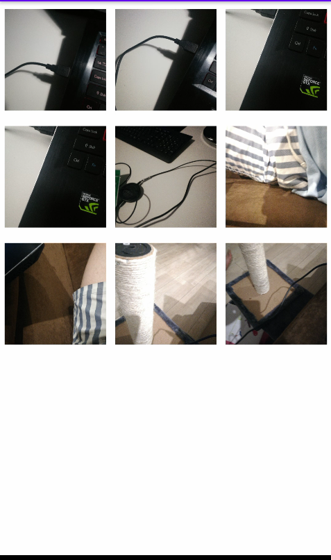
#### Camera
Camera is viewpager2's page that allow user to make images and store them in special path + details in room.
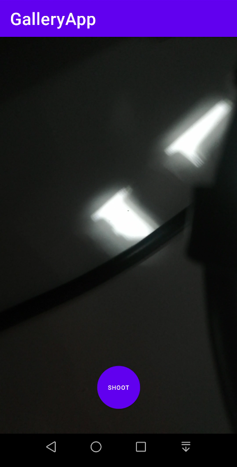
#### Image
Section represent single image stored in application, user has possibility to rate photos and comment them. 
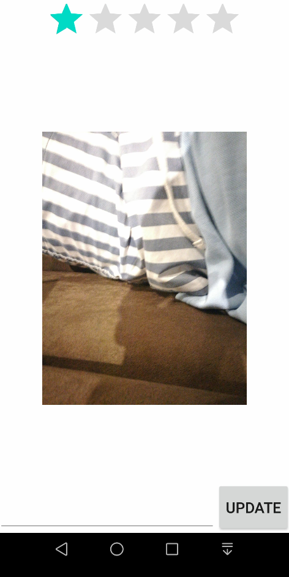
### CodeExample
```kotlin
private fun takePhoto() {

        val imageCapture = imageCapture ?: return
        Log.d(Constants.TAG, outputDirectory.toString())
        val photoFile = File(
            outputDirectory,
            SimpleDateFormat(
                Constants.FILE_NAME_FORMAT,
                Locale.getDefault()
            ).format(System.currentTimeMillis()) + ".jpg"
        )

        val savedUri = Uri.fromFile(photoFile)


        val outputOption = ImageCapture.OutputFileOptions.Builder(photoFile).build()

        imageCapture.takePicture(
            outputOption, ContextCompat.getMainExecutor(requireContext()),
            object : ImageCapture.OnImageSavedCallback {
                override fun onImageSaved(outputFileResults: ImageCapture.OutputFileResults) {
                    val msg = "Photo saved"
                    Toast.makeText(
                        requireActivity(),
                        "$msg ", Toast.LENGTH_SHORT
                    ).show()

                    // insert image to database
                    val img = Image(
                        0,
                        path = savedUri.path!!,
                        description = null,
                        rating = null
                    )
                    mImageViewModel.addImage(img)

                }

                override fun onError(exception: ImageCaptureException) {
                    Log.d(Constants.TAG, "onError: ${exception.message}", exception)
                }

            }
        )

    }
```

----------------------------
## Arcanoid
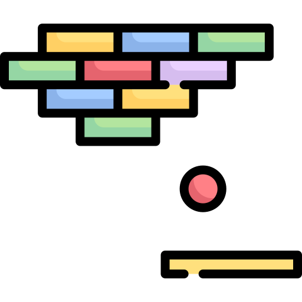


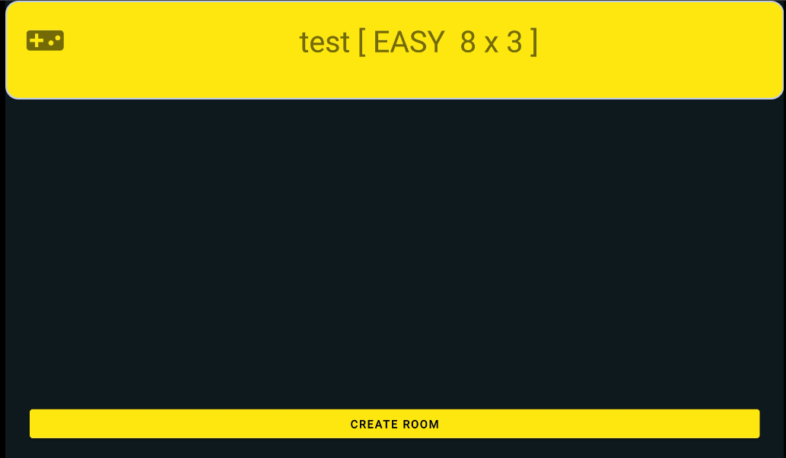

----------------------------
